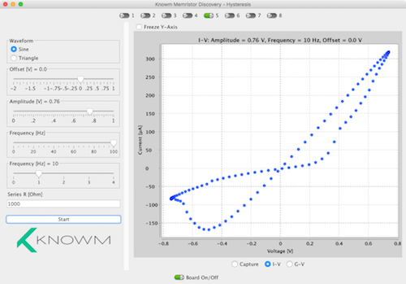
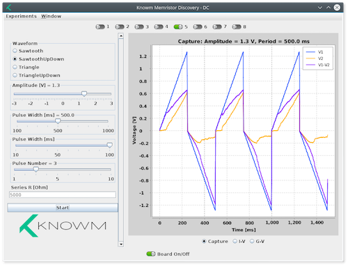
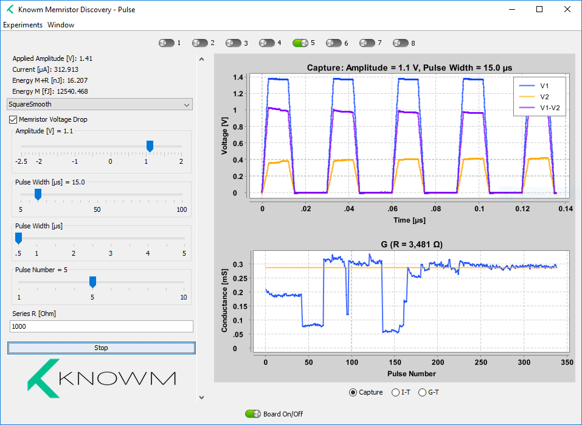

# About

Memristor Discovery is a Java application for running memristor "experiments" on the Knowm [Memristor Discovery Board](http://knowm.org/product/memristor-discovery/). It is designed to be cross-platform, meaning it runs on the latest versions of MacOS, Debian-based Linux and Windows 10. Running Memristor-Discovery requires Java and the Digilent waveforms Framework to be installed on your system (see below).

The following screenshots show Memristor-Discovery running on the three supported operating systems.







# Installing Memristor-Discovery

See [Releases](https://github.com/knowm/memristor-discovery/releases) for downloads and installation instructions.

# Pre-requisites For Running Memristor Discovery

## Install DWF Framework on MacOS X

Download Waveforms .dmg file from here: <https://reference.digilentinc.com/reference/software/waveforms/waveforms-3/start>

Move the dwf.framework to `/Library/Frameworks` and Waveforms to `Applications`, as indicated during the install of Waveforms from the DMG:


## Install DWF Framework on Windows

Download Waveforms from here: <https://reference.digilentinc.com/reference/software/waveforms/waveforms-3/start> and run the installer.

## Install DWF Framework on Ubuntu


Download Adept 2 .deb file from here: https://reference.digilentinc.com/reference/software/adept/start
Download Waveforms .deb file from here: <https://reference.digilentinc.com/reference/software/waveforms/waveforms-3/start>

Run the following commands in the terminal:

```
sudo mv ~/Downloads/digilent.adept.runtime_2.19.2-amd64.deb /var/cache/apt/archives
cd /var/cache/apt/archives
sudo dpkg -i digilent.adept.runtime_2.19.2-amd64.deb

sudo mv ~/Downloads/digilent.waveforms_3.9.1_amd64.deb /var/cache/apt/archives
cd /var/cache/apt/archives
sudo dpkg -i digilent.waveforms_3.9.1_amd64.deb
    
```

## Calibrate the AD2 Device

Open up Waveforms and select from the Menu `Settings ==> Device Manager`. In the Window that pops up, select `Calibrate`. The rest is self explanatory. Make sure to calibrate "Waveform Generator 1 Low Gain" followed by "Oscilloscope".

# For Developers Only

## Building

#### general

    mvn clean package  
    mvn javadoc:javadoc 
    mvn com.coveo:fmt-maven-plugin:format 
    mvn versions:display-dependency-updates 
    
#### maven-license-plugin

    mvn license:check
    mvn license:format
    mvn license:remove

## Running from Eclipse

Right-click on `MemristorDiscovery.java`, `Run As...` ==> `Java Application`.

## Building Executable Jar

Maven is used to build the executable jar and it will contain all the dependencies within that single jar as well. The jar `memristor-discovery.jar` will be found in the directory `target`.

    mvn clean install
    java -jar memristor-discovery.jar
    

    
