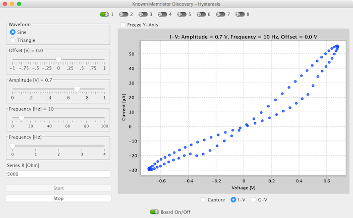
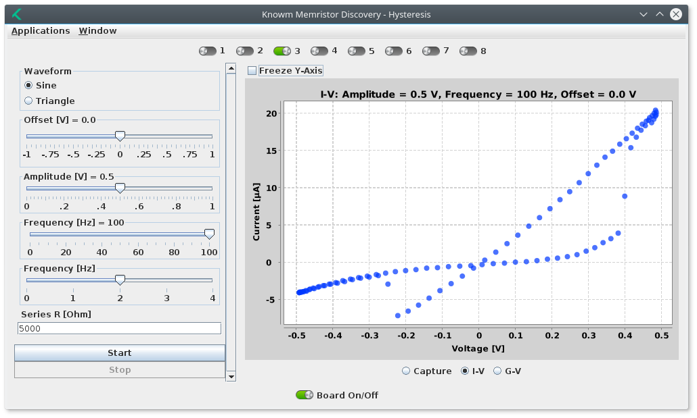
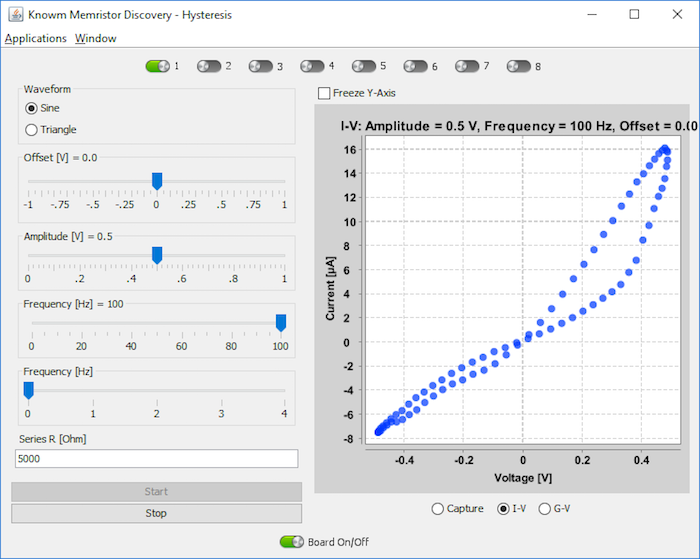
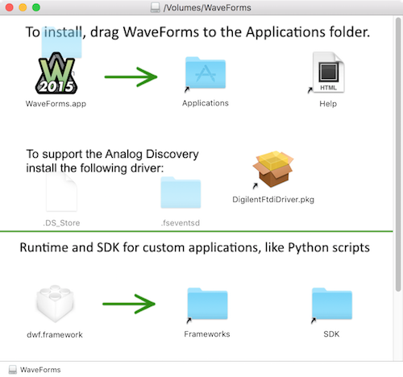

# About

Memristor Discovery is a Java application for running memristor experiments of "applications" on the Knowm [Memristor Discovery Board](http://knowm.org/product/memristor-discovery/). It is designed to be cross-platform, meaning it runs on the latest versions of MacOS, Debian-based Linux and Windows 10. Running Memristor-Discovery requires Java and the Digilent waveforms Framework to be installed on your system (see below).

The following screenshots how Memristor-Discovery running on the three supported operating systems.

# Pre-requisites For Running Memristor Discovery

## Install Java 8 Runtime Environment

### Option #1: Download and Install From Oracle

Download the Java SE Runtime Environment 8 from [Oracle's Website](http://www.oracle.com/technetwork/java/javase/downloads/jre8-downloads-2133155.html) and run the installer.

### Option #2: Install via Homebrew on Mac OSX
 
    brew update
    brew cask install java

### Option #3: Install on Ubuntu

    sudo add-apt-repository -y ppa:webupd8team/java
    sudo apt-get update
    echo debconf shared/accepted-oracle-license-v1-1 select true | sudo debconf-set-selections
    echo debconf shared/accepted-oracle-license-v1-1 seen true | sudo debconf-set-selections
    sudo apt-get -y install oracle-java8-installer
    java -version
    
    
## Install DWF Framework on Mac OSX

Move the dwf.framework to `/Library/Frameworks`, as indicated during the install of Waveforms from the DMG:

## Install DWF Framework on Linux

Download .deb files from here: <https://reference.digilentinc.com/reference/software/waveforms/waveforms-3/start>

    sudo mv ~/Downloads/digilent.adept.runtime_2.16.5-amd64.deb /var/cache/apt/archives
    cd /var/cache/apt/archives
    sudo dpkg -i digilent.adept.runtime_2.16.5-amd64.deb

    sudo mv ~/Downloads/digilent.waveforms_3.4.7_amd64.deb /var/cache/apt/archives
    cd /var/cache/apt/archives
    sudo dpkg -i digilent.waveforms_3.4.7_amd64.deb

## Install DWF Framework on Windows

Download Waveforms 2015 from here: <https://reference.digilentinc.com/reference/software/waveforms/waveforms-3/start> and run the installer.

## Calibrate the AD2 Device

Open up Waveforms 2015 and select from the Menu `Settings ==> Device Manager`. In the Window that pops up, select `Calibrate`. The rest is self explanatory. Make sure to calibrate "Waveform Generator 1 Low Gain" followed by "Oscilloscope".

# For Developers Only

## Building

#### general

    mvn clean package  
    mvn javadoc:javadoc  
    
#### maven-license-plugin

    mvn license:check
    mvn license:format
    mvn license:remove

## Running from Eclipse

Right-click on `MemristorDiscovery.java`, `Run As...` ==> `Java Application`.

## Building Executable Jar

Maven is used to build the executable jar and it will contain all the dependencies within that single jar as well. The jar `memristor-discovery.jar` will be found in the directory `target`.

    mvn clean install
    java -jar memristor-discovery.jar
    
## Design Notes

1. Help images should be 500 x 500 px.

    