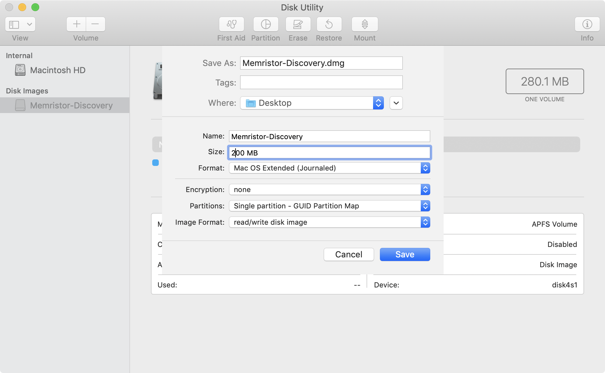
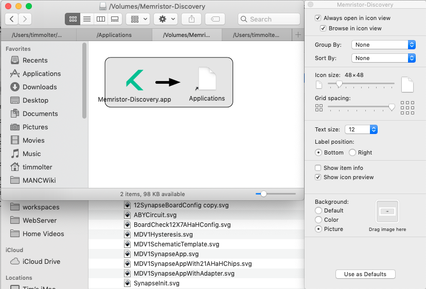

## Create install files for all 3 operating systems

### Possibilities that will be updated for Java 11 in the future

1. <https://github.com/Jorl17/jar2app>
1. <https://bitbucket.org/infinitekind/appbundler/overview>
1. <https://lerks.blog/packaging-a-jar-as-app-for-macos/>


### MacOS

We can look at the [JD-GUI app](https://github.com/java-decompiler/jd-gui/blob/master/src/osx/resources/Info.plist) to see a good and simple example of properly bundling an app for MacOS.

#### Memristor-Discovery.app

Build the mail Jar with: `mvn clean package`.

Create an icns file via <https://iconverticons.com/online/>. Place under `_img` with name `icons.icns`.

Manually download the MacOS OpenJDK from <http://jdk.java.net/11/>. Un-tar it.

Prepare the Java 11 JDK for Packr. 

It requires a `jre` folder because of the the way old Java JDKs organized the directory structure. If Packr ever updates, this may not be necessary in the future, but for now it is. Create `jre` under `Contents/Home`. Move `lib` and `bin` into this new `jre` folder. You can also remove `src.zip` under `lib` as it's just extra unneeded bulk. 

Right-click the `jdk-11.0.2.jdk` folder and choose `compress` to create a zip file, which is required by Packr.

Update `JDK_LOCATION` in `MacOSPackr` to reflect the created zip file. 

Run `MacOSPackr` in test package. This will create a `*.app` file which could be dragged into `Applications` and clicked on like a normal app.

Open up the *.app folder and add the following to the Info.plist file:

```
<key>CFBundleLongVersionString</key>
<string>0.0.7, Copyright 2016-2019 Knowm Inc</string>
<key>CFBundleShortVersionString</key>
<string>0.0.7</string>
```

#### Memristor-Discovery.dmg

<https://medium.com/@adam_carroll/java-packager-with-jdk11-31b3d620f4a8>
<http://chromasoft.blogspot.com/2010/02/building-dmg-installer-for-mac-simple.html>
<https://stackoverflow.com/a/37310294/1625820>

To package the app in an "installer", we need to create a DMG file with a few things in it. 

1. Open Disk Utility
1. File ==> New Image ==> Blank Image



1. Mount and open the DMG in Finder
1. Switch to Icon view
1. Drag `*.app` into it.
1. In Terminal: `cd /Volumes/Memristor-Discovery/` `ln -s /Applications Applications`
1. Right-click ==> Show View Options
1. Drag the DMG_Background image as the background picture.



1. Eject the DMG.

1. Compress it with Disk Utility. Images ==> Convert. Select DMG. Choose `compressed`, which is also read-only. (https://support.apple.com/en-gb/guide/disk-utility/convert-a-disk-image-to-another-format-dskutl1002/mac)

### Windows

Run `WindowsPackr` in test package. This will create a folder called `Memristor-Discovery"`. Zip it.

### Linux

## Preferences

On MacOS, Preferences are store in ~/Library/org.knowm.memristor. You can read the binary plist files in XCode.

## JavaPackager

1. <https://medium.com/@adam_carroll/java-packager-with-jdk11-31b3d620f4a8>


### JDEPS

To find out which JRE deps are needed

```bash
/Library/Java/JavaVirtualMachines/openjdk-11.0.2.jdk/Contents/Home/bin/jdeps --list-deps /Users/timmolter/workspaces/workspace_knowm/memristor-discovery/jar/memristor-discovery-0.0.8-SNAPSHOT.jar
```

[Source](https://medium.com/azulsystems/using-jlink-to-build-java-runtimes-for-non-modular-applications-9568c5e70ef4)

### MacOS


[Download](https://mail.openjdk.java.net/pipermail/openjfx-dev/2018-September/022500.html) the MacOS binary and place in `usr/local/Cellar`.


```
brew cask install java
nano ~/.bash_profile
export JAVA_HOME=`/usr/libexec/java_home`
echo $JAVA_HOME 
/usr/local/Cellar/jdk.packager-osx/jpackager --version
```

```
mvn package
```
Move jar to `jar` folder manually. It needs to be isolated like this in order for `jpackager` to only pull in the jar into the final package.


```bash
cd ~/workspaces/workspace_knowm/memristor-discovery
./package_macos.sh
```

### Windows

```
cd /c/Users/knowm/Documents/GitHub/memristor-discovery
./package_windows.bat
```

Open the *.iss file in Inno Setup and hit run. An installer will be created in `_exe/Output`.


