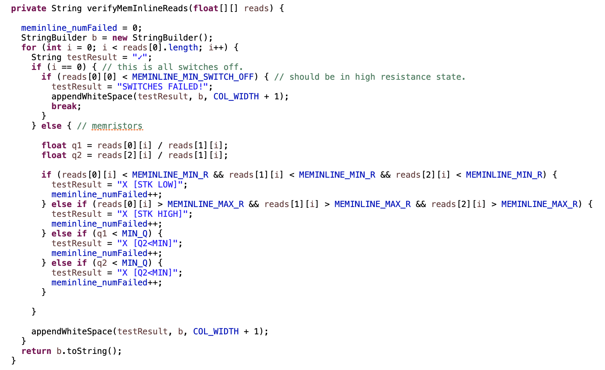

# BoardCheck Experiment

This experiment tests the functionality of the memristor discovery boards and discrete memristor chips. Paramount to measurement is validated equipment. All boards and chips shipped by Knowm Inc have passed these tests as part of quality control. 

1. Bilateral Switches via **Switch Board Test** Button 
2. 1-4 Muxes via **1-4 Mux Board Test** Button 
3. Knowm Discrete Memristor chips. via **Discrete Chip Test** Button 

The Discrete Chip Test will accept old 16-pin DIP chip discrete chips as well as the new 1X16 linear array chips. 

## Switch Board Test

This test activates each switch in order and applies a read pulse. The voltage drop across the series resistor is used to calculate the resistance in the memristor sockets. 

## 1-4 Mux Board Test (Deprecated)

This tests each of the 1-4 muxes. It does this by routing a voltage of a specific value to each of the three junctions while also routing the oscilloscopes. If any of the tests fail, it is reported and the whole test will fail. The measured voltage is compared to the generated voltage for each route and oscilloscope channel and the deviation is shown.

## Discrete Chip Test

This test applies a sequence of pulses across each memristor, using the voltage drop across the series resistor to measure the memristor resistance. The sequence is as follows:

1. Write
2. Reset 
3. Read-->R0
4. Write
5. Read-->R1
6. Reset
7. Read-->R2

Default Constants:

V_READ = .1f;
V_WRITE = 1.0f;
V_RESET = -2f;

MEMINLINE_MIN_Q = 2;
MEMINLINE_MIN_R = 10;//kΩ
MEMINLINE_MAX_R = 100;//kΩ
MEMINLINE_MIN_SWITCH_OFF = 1000;//kΩ

The following code is used for testing. This can be found in 'BoardCheckExperiment.java' in the 'verifyMemInlineReads()' method near line 545. [See Code on GitHub](https://github.com/knowm/memristor-discovery/blob/master/src/main/java/org/knowm/memristor/discovery/gui/mvc/experiments/boardcheck/BoardCheckExperiment.java).

## Preferences

The preferences window allows you to save your preferred experimental control parameters between sessions of using the app.
