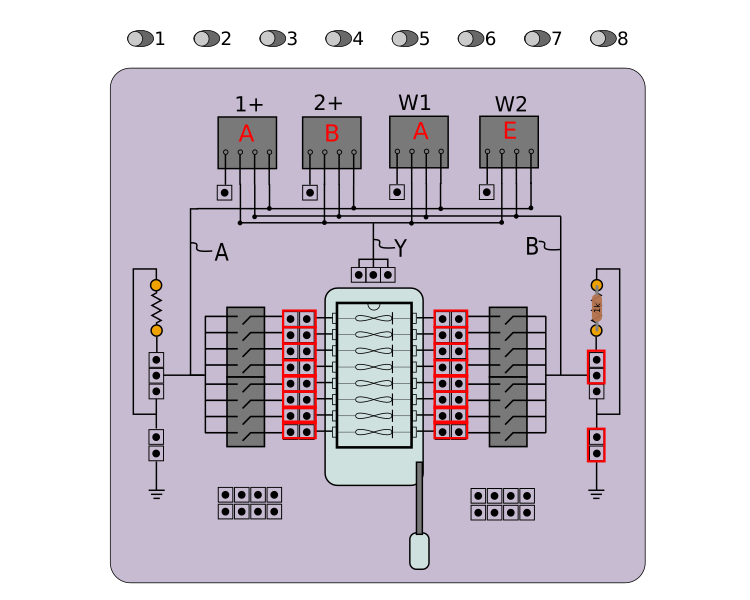

# Hysteresis Experiment

This experiment drives a memristor in series with a resistor with a sinusoidal or triangle waveform and allows you to observe the response as a time series, current-vs-voltage (I-V) or conductance-vs-voltage (G-V) plot, revealing the signature hysteresis behavior of the memristor. The user can adjust the input signal voltage, frequency and offset and observe the response in real-time. The circuit under test depends on the Memristor Discovery board version, as shown here:

**W1**: Arbitrary Waveform Generator One on the Analog Discovery 2

**1+**: Oscilloscope Probe 1+ on the Analog Discovery 2

**2+**: Oscilloscope Probe 2+ on the Analog Discovery 2

## V2.0 Mode 1 Selection

Memristor Discovery V2.0 boards must be set to "Mode 1" by moving selection switch on board to the '1' position. 

## V1.X (Deprecated) Jumper Connections

## Memristor Selection

Use the toggle switches near the top of the app window to connect one or more individual memristors into the circuit. 

## Series Resistor

The series resistor provides two important functions:

1.  Limits the maximum current through the memristor to prevent device damage (see memristor datasheet).
2.  Allows for a current measurement to be made with the oscilloscope.

Version 2.0 Memristor Discovery boards have two series resistors, A and B. These resistors are connected in parallel when the board is in Mode 1. The series resistance of the circuit is thus half of the value of the resistors in the socket, which needs to be reflected in the preferences menu. Boards are shipped with 20kΩ precision resistors. Alternately, you may remove either resistor A or B and record the value of the remaining resistor in the preferences. Whatever you do, the value of the series resistor in the preferences must match the actual series resistance for measurements to be accurate.

## Conductance Plot Averaging

The conductance plot (G-V) uses a running average value, k, to smooth the data and reduce measurment noise. A k value of 1 eliminates averaging. The smaller k is, the more averaging will occur. If k is too small you may unknowingly hide important memristor behavior so it is best to keep k as close to 1 as possible. 

Gave(t)=k*Gave(t-1)+(1-k)G(t)

notes:
 
1. You can change the default k value in the preferences.
2. When changing the k value in the control above the G-V plot, it will only accept values between 0 and 1.  

## Exporting Data

Any plot can be right-clicked to export the data in either chart format (save As...) or comma-separated-values (Export As...), which can be opened in spreadsheet software. For "Export As..." option, a directory needs to be selected. In that directory, an individual CSV file will be created for each series in the plot.

## Preferences

The preferences window allows you to save your preferred experimental control parameters between sessions of using the app.
