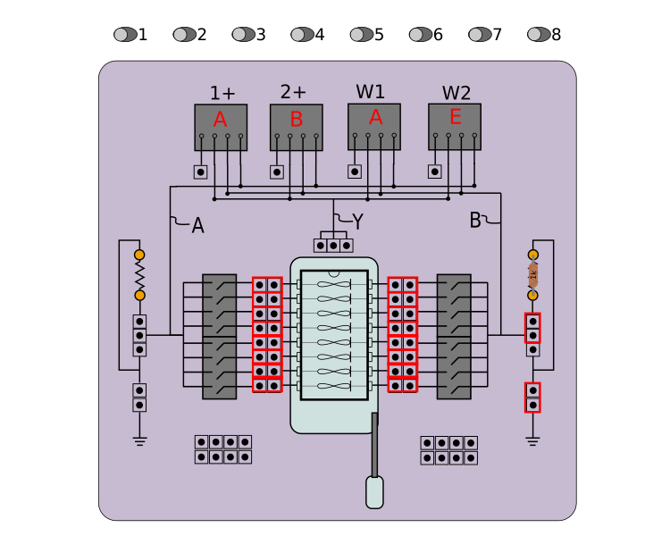

# Pulse Experiment

The Pulse App allows you to drive a memristor in series with a resistor with one or more pulse waveforms and observe the instantaneous and post-pulse response. The instantaneous response is displayed on the upper chart as a time series of voltage (1+,2+ vs T) and current (I vs T). The instantaneous pulse response for each following 'read pulse' is also displayed, updated after every read pulse. The lower plot shows the conductance of the memristor, as measured by the low-voltage (.1V) read pulse. The sampling rate of read pulses can be set on the control panel. 

**W1**: Arbitrary Waveform Generator One on the Analog Discovery 2

**1+**: Oscilloscope Probe 1+ on the Analog Discovery 2

**2+**: Oscilloscope Probe 2+ on the Analog Discovery 2

The energy estimation for the applied pulse is displayed above the pulse type selection box and is calculated from the following equation: 

AppliedEnergy = AppliedAmplitude * AppliedAmplitude / (MemristorResistance + SeriesResistorResistance + SwitchResistances) * PulseNumber * PulseWidth;

This is the energy dissipated across the memristor and series resistor during the applied pulse, using the estimated memristor resistance and measured by the read pulses. This does not take into account the energy that is dissipated by the charging and discharging of wires.

## V2.0 Mode 1 Selection

Memristor Discovery V2.0 boards must be set to "Mode 1" by moving selection switch on board to the '1' position. 

## V1.X (Deprecated) Jumper Connections

## Memristor Selection

Use the toggle switches near the top of the app window to connect one or more individual memristors into the circuit. 

## Series Resistor

The series resistor provides two important functions:

1.  Limits the maximum current through the memristor to prevent device damage (see memristor datasheet).
2.  Allows for a current measurement to be made with the oscilloscope.

Version 2.0 Memristor Discovery boards have two series resistors, A and B. These resistors are connected in parallel when the board is in Mode 1. The series resistance of the circuit is thus half of the value of the resistors in the socket, which needs to be reflected in the preferences menu. Boards are shipped with 20kΩ precision resistors. Alternately, you may remove either resistor A or B and record the value of the remaining resistor in the preferences. Whatever you do, the value of the series resistor in the preferences must match the actual series resistance for measurements to be accurate.

## Conductance Measurements

Data captured from the read pulses is used to estimate the conductance value of the memristor. To account for the parasitic capacitance of the board, as well as the parasitic 1MΩ resistance of the 1X scope of the Analog Discovery 2, we have integrated our open-source Spice circuit simulator *JSpice* into Memristor discovery. The simulation engine performs a temporal simulation of the board with its parasitics and the given series resistor for many values of memristor resistance, from 100Ω to 10MΩ. It records the final voltage at the end of the read pulse time window and then creates a look-up table that associates this voltage with a memristor resistor. 

## Exporting Data

Any plot can be right-clicked to export the data in either chart format (save As...) or comma-separated-values (Export As...), which can be opened in spreadsheet software. For "Export As..." a directory needs to be selected. In that directory, an individual CSV file will be created for each series in the plot.

## Preferences

The preferences window allows you to save your preferred experimental control parameters between sessions of using the app.