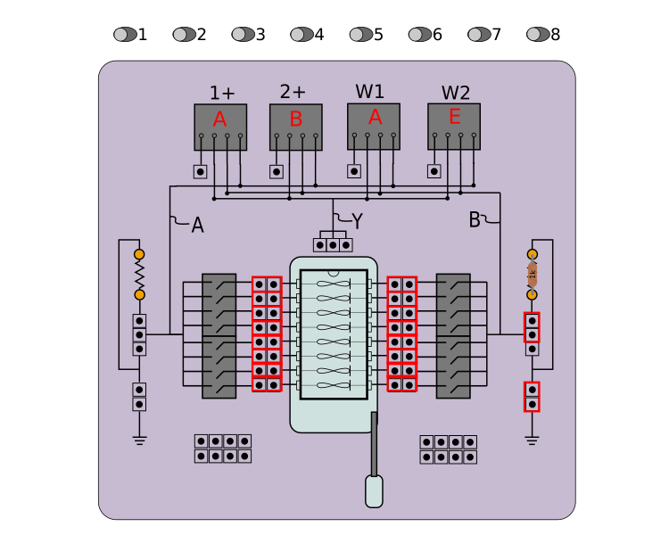

# Pulse Experiment

The Pulse App allows you to drive a memristor in series with a resistor with one or more pulse waveforms and observe the instantaneous and post-pulse response. The instantaneous response is displayed on the upper chart as a time series of voltage (V1+ vs T) and (V2+ vs T), current (I vs T) or conductance (G vs T). The lower plot shows the conductance of the memristor, as measured by a low-voltage (.1V) pulse. The sampling rate of these measurements can be set on the control panel. 

W1: Arbitrary Waveform Generator W1 on the AD2.
1+: Oscilloscope Probe 1+ on the AD2.
2+: Oscilloscope Probe 2+ on the AD2.

notes: 

AD2 = Analog Discovery 2
1- and 2- are connected to ground.

*note:*

1. A memristor undergoes a dynamic internal change after receiving an impulse, and this response can extend *beyond* the timescale of the impulse. We have observed 'cascades', where the conductance of the memristor continues to fall (or climb) *after* application of a pulse. In addition, non-linearities in equipment and devices can result in measurement deviations if two different read voltages are used to measure conductance at two moments in time. Hence, the changes in a memristor is revealed when measurments are performed over time scales longer than the impulse and constant read voltages are used. 

2. The energy estimations are calculated from the following equation: 

AppliedEnergy = AppliedAmplitude * AppliedAmplitude / (MemristorResistance + SeriesResistorResistance + SwitchResistances) * PulseNumber * PulseWidth;

## V2.0 Mode 1 Selection

Memristor Discovery V2.0 boards must be set to "Mode 1" by moving selection switch on board to the '1' position. 

## V1.X Jumper Connections

## Memristor Selection

Use the toggle switches near the top of the app window to connect one or more individual memristors into the circuit. 

## Series Resistor

The series resistor provides two important functions:

1.  Limits the maximum current through the memristor to prevent device damage (see memristor datasheet).
2.  Allows for a current measurement to be made with the oscilloscope.

### V2.0 Series Resistors

Version 2.0 Memristor Discovery boards have two series resistors, A and B. These resistors are connected in parallel when the board is in Mode 1. The series resistance of the circuit is thus half of the value of the resistors in the socket, which needs to be reflected in the preferences menu. Alternately, you may remove either resistor A or B. Whatever you do, the value of the series resistor in the preferences must match the actual series resistance for measurements to be accurate.

## Exporting Data

Any plot can be right-clicked to export the data in either chart format (save As...) or comma-separated-values (Export As...), which can be opened in spreadsheet software. For "Export As..." a directory needs to be selected. In that directory, an individual CSV file will be created for each series in the plot.

## Preferences

The preferences window allows you to save your preferred experimental control parameters between sessions of using the app.