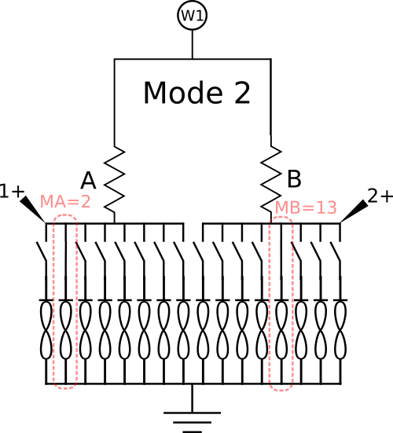

# Synapse 1-2 Experiment

*Requires Version 2.0 Memristor Discovery Board in Mode 2 with a 1X16 linear array chip*

This app allows you to drive kT-RAM differential-pair memristor synapses with elemental kT-RAM instructions and observe a continuous response in synaptic state and synaptic pair conductances via repeated `FLV` read instructions. When the "Start" button is clicked or the "s" key is pressed, the selected instruction is executed, followed by continuous read instructions executed at the given sample rate. Read instructions will be read until the "Stop" button is clicked or the "s" key is pressed, at which point a new instruction can be selected and the process repeated. The pulse shape, amplitude and width can be varied.

## Synapse Selection

A synapse is formed by selecting two memristors to form a differential pair. Memristor A is selected from 1-8 in the top memristor selection menu, while memristor B is selected from 8-16. Two and only two memristors can be selected. The series resistors in each of the A and B resistor sockets must match each other and the value set in the preferences menu. It is recommended to use a precision resistor to minimize measurement variance. 

## Circuit Configuration and Voltage Polarity Conventions

The above circuit depicts the synapse circuit where memristor A is selected from memristor 2 on the chip, while memristor B is selected from memristor 13 on the chip. Note that all of the memristor anodes share a common ground. To increase the conductance of the selected memristors it is necessary to lower the driver voltage W1 below zero (ground). While the applied pulse on W1 is *negative*, the voltage drop across the memristor is defined to be *positive*, since in this case the cathode is the lower potential. 

## Instructions

Notes:

1. The conductance of each memristor in the synapse is calculated by determining a voltage drop across the A and B precision series resistors during a FLV operation. If the voltage drop is not sufficient to make a measurement (because it falls below the resolution of the AD2),  the data is not recorded in the chart and a message is printed to the consol (Menu-->Help--Consol).

## Exporting Data

Any plot can be right-clicked to export the data in either chart format (save As...) or comma-separated-values (Export As...), which can be opened in spreadsheet software. For "Export As..." a directory needs to be selected. In that directory, an individual CSV file will be created for each series in the plot.

## Preferences

The preferences window allows you to save your preferred experimental control parameters between sessions of using the app.