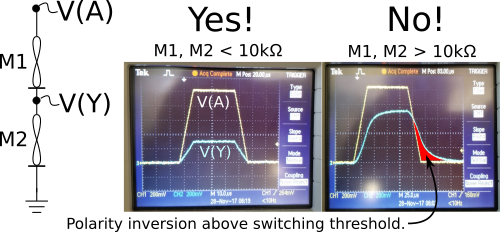
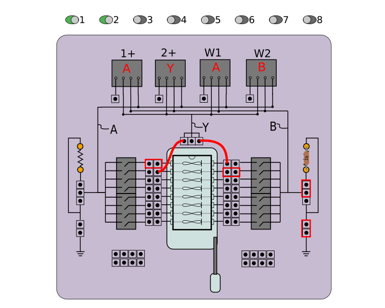
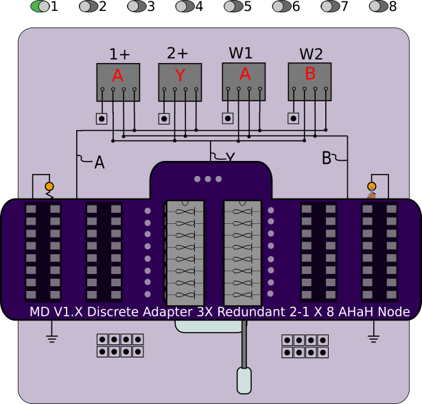
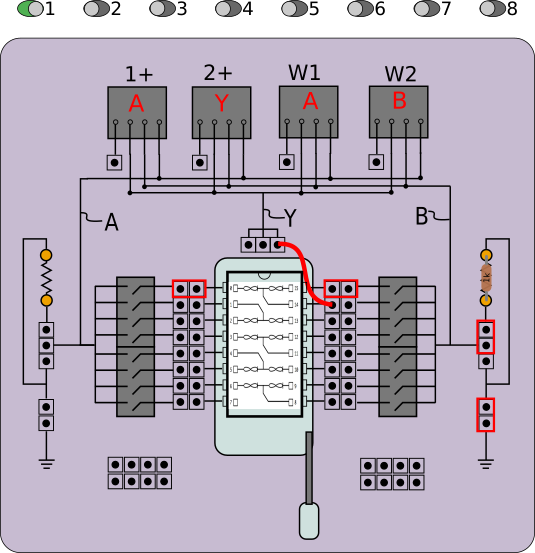
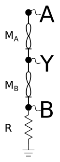

#IMPORTANT NOTICE

This experiment has been deprecated and replaced with the Synapse12 experiment with the Memristor Discovery 2.0 board. If you have purchased a V1.x board and would like a replacement V2.0 board, please contact Knowm Inc or send a self-addressed stamped envelope containing the V.1x board and we will replace it with the V2.0 board.

# Synapse 2-1 Experiment

This app allows you to drive a 2-1 kT-RAM synapse with elemental kT-RAM instructions and observe a continuous response in synaptic state and synaptic pair conductances via repeated `FFLV` read instructions. When the "Start" button is clicked or the "s" key is pressed , the selected instruction is executed, followed by continuous read instructions executed at the given sample rate. Read instructions will be read until the "Stop" button is clicked or the "s" key is pressed, at which point a new instruction can be selected and the process repeated. The pulse shape, amplitude and width can be varied.

Notes:

1. The conductance of each memristor in the synapse is calculated by determining a voltage drop across the series resistor during a FFLV operation as well as the voltage drop across each memristor. If the current is very low or the series resistance is low, the voltage drop may not be sufficient to make a measurement as it falls below the resolution of the AD2. In this case, the data is not recorded in the chart and a message is printed to the consol (Menu-->Help--Consol). The synaptic state, Vy, can be measured at all times even if the current is low, although it may become suseptible to noise for very low currents..
2. RC effects can render the 2-1 synapse partially or totally non-functional if memristors have not been initialized properly. The memristors should been conditioned into a higher conductance state of .1 to 1mS. If both memristors are in a low conductance state, capacitive charge and discharging effects on the Y node become significant, to the point where the voltage polarity across the synapse is reversed. For an FF operation this can lead to an "erase" following a "write", which in turn will undo any conductance increase. That is, the conductance of the memristors will rise during the first part of the pulse, but when the drive signal is removed, capacitive discharge inverts the polarity and causes memristor A to erase. This can have the effect of driving the synaptic state (Vy) low.

## Synapse Initialization

### Manual

1. Turn on the switches associated with the synapse.
2. Set the Amplitude to 1.5V and the Pulse Width to 500ms.
3. Use the 'RHaup' instruction to increase the conductance of the 'A' memristor until it is at least .0002S (5kΩ). 
4. Use the 'RHbup' instruction to increase the conductance of the 'B' memristor until it is at least .0002S (5kΩ).
5. Repeatedly use the FF-RA instruction until Vy oscillates about zero.

### Initialize Synapse Button

With the synapse or group of synapses selected, hit the button. It will perform the above manual steps. Steps (3) and (4) will be applied a maximum of 50 times before initialization fails.

View the consol to see results and warnings. (Window-->Consol)

## Connections

This experiment can be run in multiple configurations depending on available memristor chips and adapter boards. 

### Method 1: Discrete Memristor Chip

The user must configure the jumpers in such a manner as to form a 2-1 synapse with available memristors on the discrete chip. While the configuration below will form a 2-1 synapse from memristors 1 and 2, the user can adapt this soas to form a synpase from any other two memristors on the discrete chip. 

1. The jumper on the left side of memristor #1 connects to node `A`.
1. The jumper on the right side of memristor #2 connects to node `B`.
1. A jumper cable connects the right side of memristor #1 with node `Y`.
1. A jumper cable connects the left side of memristor #2 with node `Y`.

### Method 2: Discrete Adapter Board

The discrete 2-1 X 8 AHaH Node adapter board can be used to form 8 distinct 2-1 synapses from 2, 4 or 6 discrete memristor chips. To use the adapter board, remove all jumpers and plug the adapter board in over the dip socket.

### Method 3: 2-1 X 5 Synapse chips

Configure the jumpers as shown and wire to the 2-1 synapse junction pin to the "Y" node. 

## Synapse Selection

Use the toggle switches near the top of the app window to select a synapse into the circuit. The selection of synapses depends on the connection method used. 

For connection method (2), simply enable the switch that directly corresponds to each synapses, i.e synapse 1 is selected by enabling switch 1, etc. For method (1), one must select multiple switches. A synapse formed from memristors 1 and 2 must enable switches 1 and 2, for example. For method 2, please refer to the chip pin-out or use reference below:

Synpase 1: Switch 1

Synpase 2: Switch 3

Synpase 3: Switch 4

Synpase 4: Switch 5

Synpase 5: Switch 7

## Series Resistor

Use the jumpers on the right to select the series resistor and route it to ground. The default series resistor is 1kΩ. If you change this, be sure that you change this in the preferences as well. For best results, choose a resistor that is about equal to the expected median resistance range of the memristors in the synapse. The series resistor is only used during the FFLV instruction to measure current.

## Controls

The control panel can be used to adjust the driver waveform, pulse width and kT-RAM instruction. Each instruction applies a voltage pulse across the synapse in a different way given by the table below. Please use the following circuit for reference.

### Atomic Instructions

A, B and Y nodes are *floating* unless otherwise specified. "Amp" is the voltage **Amp**litude as set by the control slider.

**FFLV**:  V(A)=.1 V

**RFLV**:  V(A)=-.1 V

**FF**:  V(A)=Amp V

**RF**:  V(A) = -Amp V, V(B) = Gnd

**RL**:  See RLadn.

**RH**: See RHbdn.

**RHbdn**:  V(B) = Amp V, V(Y) = Gnd

**RLadn**: V(A) = - Amp V, V(Y)= Gnd

**RHaup**: V(A) = Amp V, V(Y) = Gnd

**RLbup**: V(B) = - Amp V, V(Y) = Gnd

### Compound Instructions

**FF_RL**: The FF instruction followed by the RL (RLadn) instruction

**FF_RH**: The FF instruction followed by the RH (RHbdn) instruction

### Conditional Compound Instructions

**FF_RU**: FF_RL instruction if the synaptic state evaluted *below* zero on the last FFLV instruction, else FF_RH.

**FF_RA**: FF_RL instruction if the synaptic state evaluted *above* zero on the last FFLV instruction, else FF_RH.

## Exporting Data

Any plot can be right-clicked to export the data in either chart format (save As...) or comma-separated-values (Export As...), which can be opened in spreadsheet software. For "Export As..." a directory needs to be selected. In that directory, an individual CSV file will be created for each series in the plot.

## Preferences

The preferences window allows you to save your preferred experimental control parameters between sessions of using the app.